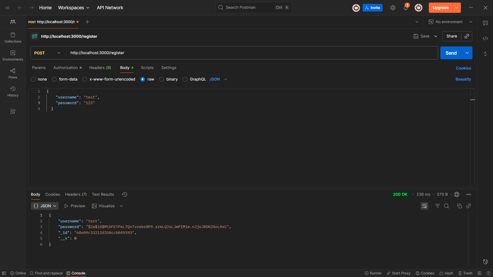
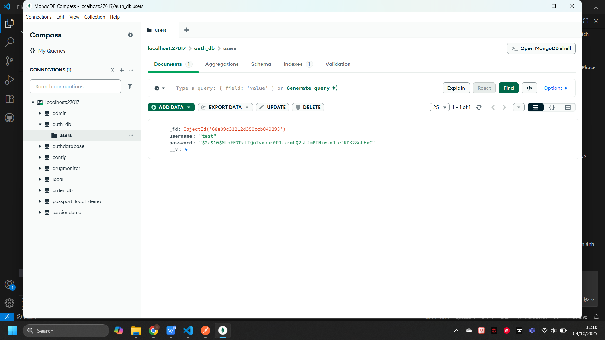
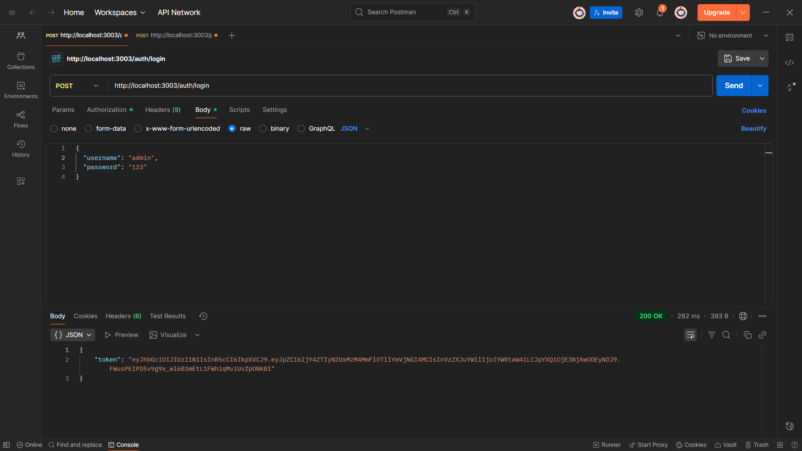
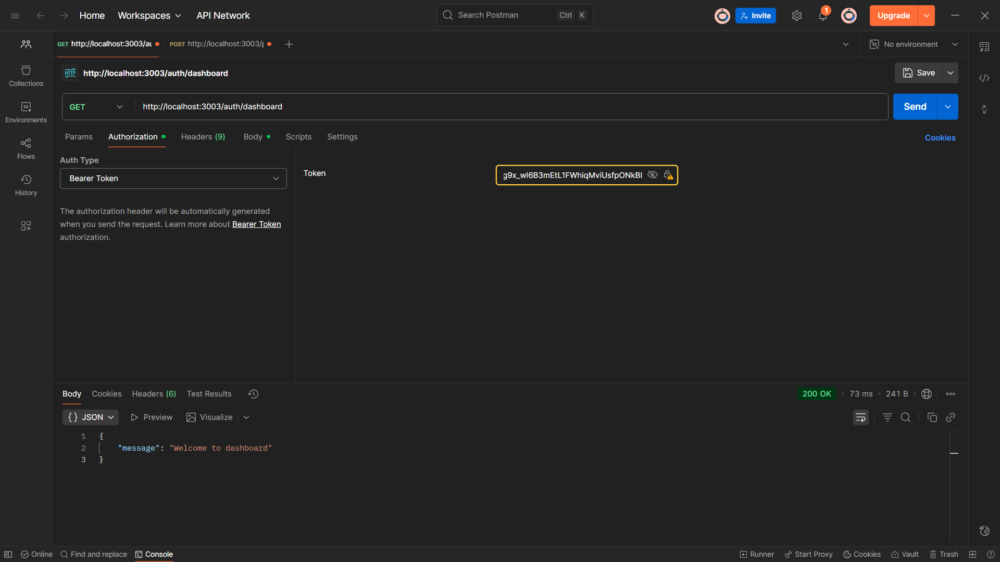
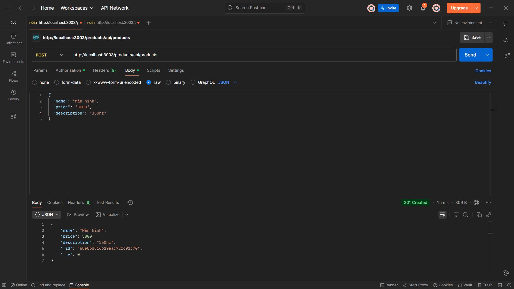
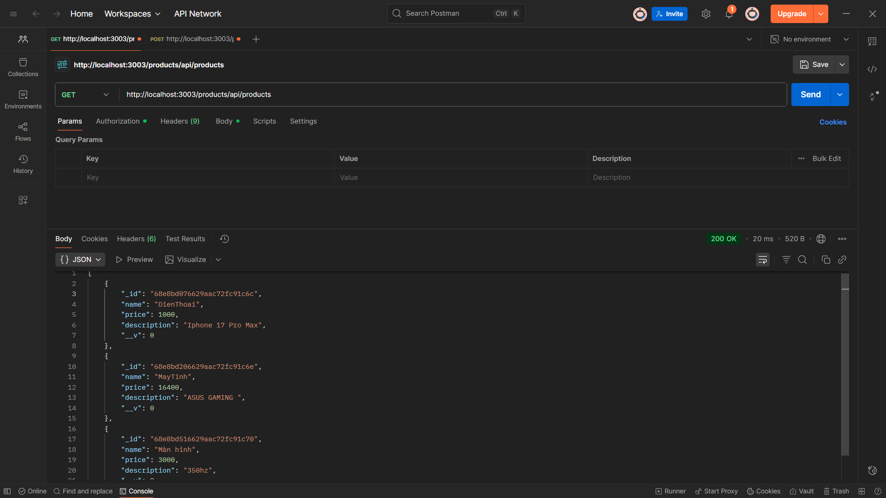
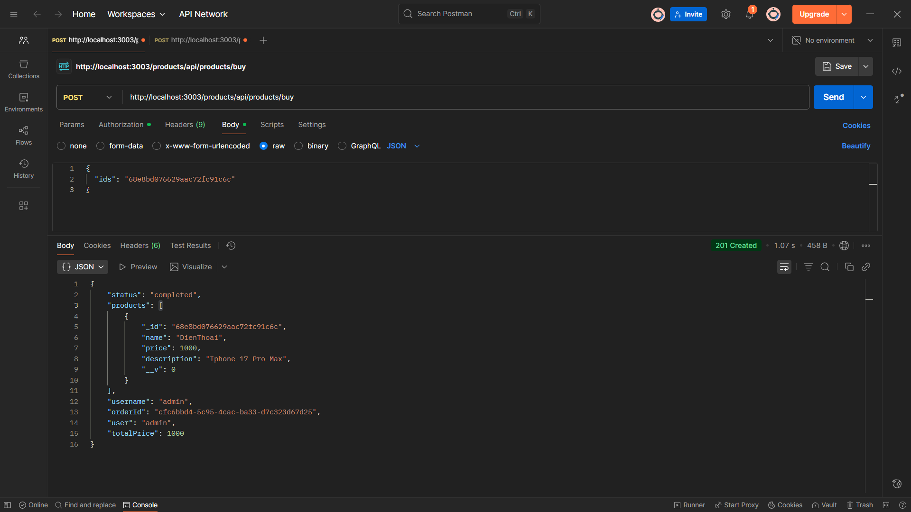
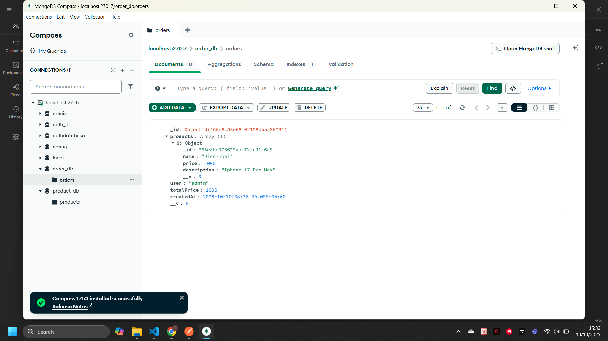

Mô tả dự án
EProject-Phase-1 là một hệ thống thương mại điện tử được xây dựng theo kiến trúc microservices. Hệ thống bao gồm 4 services chính: API Gateway, Authentication Service, Product Service và Order Service, sử dụng MongoDB làm cơ sở dữ liệu và RabbitMQ để giao tiếp giữa các services.
Authentication Service (/auth)
- `POST /auth/register` - Đăng ký tài khoản
- `POST /auth/login` - Đăng nhập
- `GET /auth/dashboard` - Dashboard (cần token)

Product Service (/products)
- `GET /products/api/products` - Lấy danh sách sản phẩm
- `POST /products/api/products` - Tạo sản phẩm mới
- `PUT /products/api/products/:id` - Cập nhật sản phẩm
- `DELETE /products/api/products/:id` - Xóa sản phẩm

Order Service (/orders)
- Nhận orders từ RabbitMQ queue
- Xử lý và lưu orders vào database
Đăng ký tài khoản

Đăng nhập

Dashboard (Protected Route)
<!-- Thêm ảnh screenshot dashboard ở đây -->

2. Product Management

Tạo sản phẩm mới

Danh sách sản phẩm

Mua sản phẩm

### 🎯 Tính năng chính

- ✅ **Authentication**: Đăng ký, đăng nhập với JWT
- ✅ **Product Management**: CRUD operations cho sản phẩm
- ✅ **Order Processing**: Xử lý đơn hàng qua message queue
- ✅ **API Gateway**: Single entry point cho tất cả requests
- ✅ **Microservices Architecture**: Loosely coupled services
- ✅ **Database Integration**: MongoDB với Mongoose ODM
- ✅ **Message Queuing**: RabbitMQ cho async communication
- ✅ **Unit Testing**: Test coverage cho core functionalities
